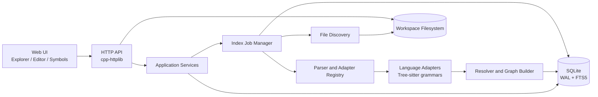

# Code Indexer/Browser Architecture

## Purpose

This document defines the recommended architecture for the local-first code indexer and browser described in `docs/requirements.md`. It explains the major components, their responsibilities, dependency boundaries, data flow, and the rationale behind the principal design choices.

## Rationale

### Local-first architecture

The indexer operates on source trees that are normally local to the developer's machine. Keeping indexing, source access, and the database local provides low latency, avoids uploading proprietary code, and allows the application to work without network access. The HTTP server is therefore an internal application boundary rather than a mandatory remote service boundary.

The server should bind to localhost by default. Authentication and stronger transport controls are required before exposing it on a network interface.

### C++ backend

C++ is appropriate for the backend because the application is primarily a long-running filesystem, parsing, indexing, and query service. It provides predictable resource usage, good access to Tree-sitter's native API, efficient concurrency, and straightforward SQLite integration.

The backend should use modern C++20, RAII for resource ownership, explicit error handling, and small interfaces between subsystems. Application services should hide implementation details from both HTTP handlers and tests.

### Tree-sitter as the parsing foundation

Tree-sitter provides fast incremental parsing, error-tolerant syntax trees, and grammar support for the required languages. It is a good common foundation for syntax highlighting and syntax-level extraction.

Tree-sitter is not a complete semantic analyzer. It does not, by itself, reliably resolve C++ overloads and templates, compiler configurations, Python dynamic dispatch, or JavaScript property flow. The architecture therefore separates parsing from semantic resolution. Adapters extract explicit syntax facts, while a resolver applies language-specific and workspace-level rules and records confidence and ambiguity.

This permits useful results to be returned quickly without representing heuristic results as certain facts.

### Language-specific adapters behind a common interface

The target languages have materially different concepts of scope, imports, types, declarations, and references. A single universal extractor would become a collection of language conditionals and would be difficult to test.

Each adapter should own Tree-sitter grammar details and language-specific extraction rules while returning a normalized intermediate representation. The core indexer, database, resolver infrastructure, and HTTP API operate on that representation and do not need to know Tree-sitter node names.

Adding a language should therefore require registering an adapter and its fixtures, not modifying the indexing pipeline.

### Separate syntax indexing from semantic resolution

A two-stage model provides a better user experience and a simpler failure model:

1. **Syntax indexing** discovers files, parses changed files, extracts symbols and ranges, and produces highlighting.
2. **Semantic indexing** resolves imports, names, calls, inheritance, and references across files.

The syntax stage can make the browser useful while the semantic stage continues in the background. It also means a language with incomplete semantic support can still provide browsing, outlining, and highlighting.

### SQLite as the durable index

SQLite is suitable for a local index because it is embedded, transactional, portable, and provides strong query capabilities without requiring a separate database service. WAL mode permits readers to continue querying while the indexer writes.

The database should contain normalized entities for workspaces, files, symbols, occurrences, references, relations, dependencies, diagnostics, and jobs. File-owned index records should be replaced transactionally so a failed parse cannot leave a partially updated file index.

FTS5 should be used for symbol search and optionally source search. Full source text should not be duplicated in the database unless source search or offline content access requires it; filesystem reads can remain the source of truth for content.

### `cpp-httplib` as a thin HTTP boundary

`cpp-httplib` is sufficient for a localhost JSON API and static frontend delivery without adding a large server framework. HTTP handlers should remain thin: validate input, call an application service, and serialize a DTO or error envelope.

Handlers must not contain SQL or Tree-sitter logic. This keeps the API testable and prevents the transport layer from becoming coupled to storage or parser implementations.

### Stable API and normalized data contracts

The frontend needs stable concepts—files, ranges, symbols, references, diagnostics, and jobs—not database-specific rows or Tree-sitter nodes. Versioned DTOs provide a contract that allows the frontend and backend to evolve independently.

Every reference should include a resolution state and confidence. Unresolved and ambiguous results are valuable to users and should be visible rather than discarded.

### Incremental indexing and bounded concurrency

Repositories can contain tens or hundreds of thousands of files. Re-parsing every file for every change would make the application impractical. The indexer should compare metadata and content hashes, parse only changed files, and remove stale records for deleted files.

Parsing can use a bounded worker pool, but SQLite writes should be coordinated through a controlled writer path and short transactions. This avoids unbounded memory use and reduces writer contention while preserving reader availability.

### Security through path containment

The application reads source files from user-selected workspace roots. Every requested path must be canonicalized and checked to remain below its workspace root. This must be enforced independently of the frontend because the HTTP API is the security boundary.

The application should bind to localhost by default, avoid logging source contents, reject binary content as text, and require explicit configuration before network exposure.

## Recommended architecture



### Component boundaries

#### 1. Web UI

Responsibilities:

- Render the lazy folder tree.
- Open files and request content ranges.
- Display syntax and semantic highlighting.
- Display file outline and diagnostics.
- Select symbols and request definitions, references, callers, callees, and graph data.
- Show indexing progress and unresolved/ambiguous results.

The UI must communicate through the versioned HTTP API and must not access SQLite or the filesystem directly. Monaco Editor or an equivalent editor is recommended for the source view.

#### 2. HTTP API layer

Responsibilities:

- Bind localhost and serve API routes and frontend assets.
- Validate route parameters, query parameters, request bodies, pagination, and ranges.
- Enforce workspace and path authorization checks.
- Map application results to versioned JSON DTOs.
- Return a consistent error envelope containing `code`, `message`, optional `details`, and `requestId`.
- Expose job status without blocking on indexing completion.

The layer should contain no SQL statements, parser traversal, or resolver algorithms.

#### 3. Application services

Responsibilities:

- Coordinate workspace management, source retrieval, search, navigation, highlighting, and indexing.
- Apply use-case validation and authorization.
- Call repositories, filesystem services, parser services, and job services.
- Present transport-independent result objects to the HTTP layer.

Suggested services:

- `WorkspaceService`
- `FileService`
- `SearchService`
- `NavigationService`
- `HighlightService`
- `IndexService`
- `JobService`

#### 4. Index job manager

Responsibilities:

- Enforce one active indexing job per workspace unless a future policy permits otherwise.
- Create, queue, cancel, and report jobs.
- Manage bounded parsing workers.
- Track totals, progress, errors, and cancellation.
- Coordinate discovery, parsing, extraction, resolution, and persistence phases.
- Ensure shutdown leaves the database consistent.

A job should be resumable at file boundaries. A failed file should produce a diagnostic and allow other files to continue unless the failure is database-wide or the job is cancelled.

#### 5. File discovery and filesystem service

Responsibilities:

- Canonicalize workspace roots and requested paths.
- Enumerate files recursively.
- Apply include/exclude patterns and default ignored directories.
- Detect language, encoding, and binary content.
- Read source content and compute metadata/content hashes.
- Identify created, changed, unchanged, renamed, and deleted files.

The filesystem service must be the only component allowed to access arbitrary workspace paths. All other components use validated file IDs or workspace-relative paths.

#### 6. Parser and adapter registry

Responsibilities:

- Select an adapter based on language ID and file name.
- Own Tree-sitter parser and tree lifetime.
- Convert source bytes to normalized ranges.
- Collect syntax errors and adapter diagnostics.
- Invoke symbol, reference, dependency, and highlight extraction.

The parser layer should expose an intermediate representation such as:

- `ExtractedSymbol`
- `ExtractedReference`
- `ExtractedDependency`
- `HighlightToken`
- `ParseDiagnostic`

It must not write directly to SQLite.

#### 7. Language adapters

Each adapter owns:

- Tree-sitter grammar registration.
- Node-type queries and traversal.
- Language-specific symbol kinds.
- Declaration and definition extraction.
- Basic references and calls.
- Imports/includes and dependency syntax.
- Syntax highlighting queries.
- Adapter fixtures and known limitations.

Each adapter returns explicit confidence or uncertainty where extraction is heuristic. For example, a dynamic Python attribute reference should not be represented as a fully resolved symbol merely because its spelling matches a known name.

#### 8. Resolver and graph builder

Responsibilities:

- Build scopes and candidate symbol sets.
- Generate deterministic symbol keys.
- Resolve dependencies and imports/includes.
- Map extracted references to symbol IDs.
- Build relations such as `contains`, `calls`, `inherits`, `implements`, `overrides`, and `imports`.
- Preserve unresolved, ambiguous, and external targets.
- Use optional build metadata such as `compile_commands.json`.

The resolver should be staged:

1. Same-file and lexical-scope resolution.
2. Dependency and module resolution.
3. Workspace-wide name resolution.
4. Language-specific enrichment such as inheritance, overloads, or interface implementation.

This allows reliable simple matches to be available even when advanced resolution is incomplete.

#### 9. Persistence layer

Responsibilities:

- Open and configure SQLite.
- Run versioned migrations.
- Provide repositories and query objects.
- Enforce transactions and foreign keys.
- Maintain FTS5 indexes.
- Store diagnostics and job progress.

Recommended SQLite configuration:

```sql
PRAGMA journal_mode = WAL;
PRAGMA foreign_keys = ON;
PRAGMA synchronous = NORMAL;
PRAGMA busy_timeout = 5000;
```

The persistence layer should expose domain-level operations such as `replaceFileIndex()` and `findReferencesToSymbol()`, not generic SQL access to callers.

#### 10. Static asset server

The backend may serve the built frontend from `cpp-httplib` for a single-process local deployment. Development can use a separate frontend dev server, but production packaging should support one executable plus static assets and a database path.

## Data flow

### Initial indexing

```text
Create workspace
  -> validate and canonicalize root
  -> create index job
  -> discover files
  -> detect language and compute file state
  -> parse changed files
  -> extract syntax IR
  -> transactionally store file-owned syntax records
  -> resolve dependencies and references
  -> store relations and FTS entries
  -> publish progress and diagnostics
  -> mark workspace ready
```

### Incremental indexing

```text
Filesystem scan
  -> compare path, size, mtime, and content hash
  -> skip unchanged files
  -> replace changed-file records atomically
  -> remove deleted-file records
  -> rebuild affected resolution results
  -> update FTS and workspace revision
```

Resolution should identify affected files rather than unnecessarily rebuilding the entire workspace. The initial implementation may conservatively re-resolve all files after a batch of changed files; the service boundary should leave room for dependency-aware invalidation later.

### Source navigation

```text
User clicks source position
  -> UI requests occurrences for file/range
  -> API calls NavigationService
  -> service resolves occurrence to symbol ID
  -> UI requests symbol details/references
  -> API returns locations, previews, confidence, and resolution state
```

## Recommended backend module structure

```text
include/codelenses/
  domain/
  filesystem/
  db/
  parser/
  index/
  resolver/
  application/
  http/

src/
  domain/
  filesystem/
  db/
  parser/
  index/
  resolver/
  application/
  http/
  app/

adapters/
  c/
  cpp/
  csharp/
  python/
  typescript/
  javascript/
  go/
  java/
  shell/
```

Dependency direction should be:

```text
domain
  <- filesystem, db, parser, resolver
  <- application
  <- http
  <- app composition root
```

The composition root constructs concrete repositories, adapters, services, and HTTP routes. Business modules should depend on interfaces where this improves testing or permits alternate implementations.

## Concurrency model

- HTTP request handlers may run concurrently.
- SQLite uses WAL mode with short read transactions.
- A bounded worker pool performs filesystem reads, hashing, and Tree-sitter parsing.
- Database writes are serialized through a writer service or carefully coordinated transactions.
- Only one active job should mutate a workspace index at a time.
- Cancellation is checked between files and between pipeline phases.
- Results from a cancelled job must not be reported as a completed workspace revision.

## Error and consistency model

- A source read failure affects one file and creates a diagnostic.
- A parse failure stores parser diagnostics and may still store partial syntax results if the adapter marks them valid.
- An extraction failure rolls back that file's replacement transaction.
- A resolver failure preserves syntax indexing and records semantic diagnostics.
- A database or migration failure fails the affected job and prevents publication of a new revision.
- API errors use stable machine-readable codes and include a request ID.

## Recommended implementation sequence

1. Establish domain types, build system, and dependency boundaries.
2. Implement SQLite migrations and repositories.
3. Implement the adapter SDK and one reference adapter.
4. Implement discovery, file state tracking, and transactional file indexing.
5. Implement the first adapters for C++, Python, TypeScript, and JavaScript.
6. Implement baseline resolution and referencer queries.
7. Implement application services and HTTP routes.
8. Implement the browser UI against mocked and then real API responses.
9. Add C, C#, Go, Java, and shell adapters.
10. Add dependency-aware invalidation, performance tests, security review, and packaging.

This sequence produces a usable syntax browser before the hardest semantic-resolution work is complete and keeps each major subsystem independently testable.
