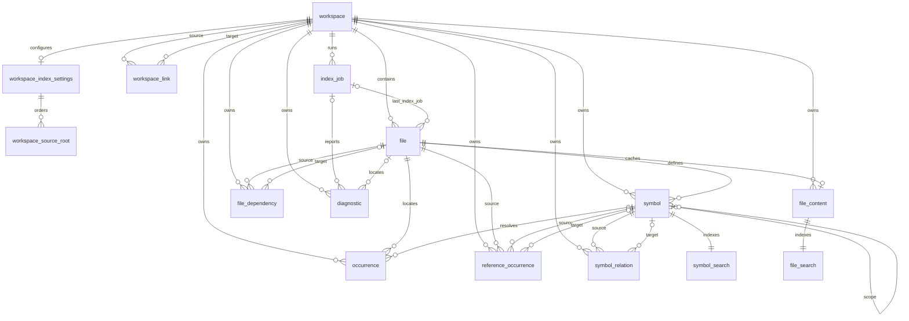
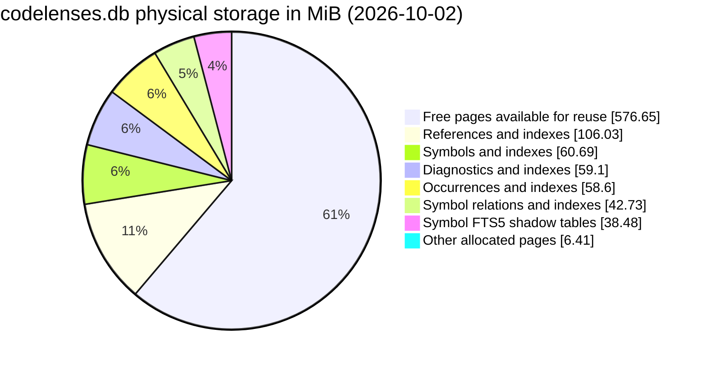

# Database Schema and DDL

## 1. Scope

This document defines the SQLite schema for the code indexer/browser. The database stores workspace metadata, discovered files, extracted syntax facts, resolved symbols and references, dependency relationships, indexing jobs, diagnostics, and full-text search indexes.

The filesystem remains the source of truth for source content by default. SQLite stores metadata and index data. Source text may be copied into the optional FTS5 content index when source search is enabled.

## 2. SQLite configuration

Open the database with foreign keys enabled and configure it once per connection:

```sql
PRAGMA foreign_keys = ON;
PRAGMA journal_mode = WAL;
PRAGMA synchronous = NORMAL;
PRAGMA busy_timeout = 5000;
PRAGMA temp_store = MEMORY;
```

Recommended rules:

- Use one writer path for indexing mutations.
- Keep write transactions bounded to one file or a bounded batch of files.
- Use read transactions for API queries.
- Do not use `PRAGMA read_uncommitted`.
- Do not store absolute source paths in request-facing records unless needed internally.
- Store workspace-relative paths using `/` as the separator.

## 3. Migration tracking

Every schema change must be a numbered migration. Migrations are applied in ascending order in one transaction.

```sql
CREATE TABLE IF NOT EXISTS schema_migration (
    version         INTEGER PRIMARY KEY,
    name            TEXT NOT NULL,
    applied_at      TEXT NOT NULL DEFAULT CURRENT_TIMESTAMP
);
```

The application must reject a database with a newer schema version than it supports.

### 3.1 Current schema and relationships

The DDL in sections 4 and 5 describes the initial schema. The current application schema is version 5, defined by the migrations registered in `src/db/migration.cpp`:

| Version | Migration | Change |
| --- | --- | --- |
| 1 | `001_initial_schema` | Core index, jobs, diagnostics, and FTS5 tables. |
| 2 | `002_library_indexes` | Workspace kind, library profiles, and library attachments. |
| 3 | `003_csharp_library_profiles` | Target framework and ordered library source roots. |
| 4 | `004_inheritance_occurrences` | Adds `inheritance` to occurrence kinds by rebuilding the table. |
| 5 | `005_linked_workspaces` | Renames profiles to `workspace_index_settings` and roots to `workspace_source_root`; replaces library attachments with directed `workspace_link` records and removes workspace root uniqueness. |

`workspace_source_root.profile_id` retains its historical column name but references `workspace_index_settings.id`. Each workspace can have one settings record and can link to several other workspaces. The initial workspace schema also includes `default_compile_command TEXT` alongside `compile_commands_path`.

The following diagram shows the current logical relationships. Nullable foreign keys allow unresolved targets and records without a file or job. FTS connections are logical external-content relationships, maintained by triggers; they are not foreign keys. SQLite indexes and FTS shadow tables are omitted.



## 4. Core schema

The following DDL represents the initial schema migration.

### 4.1 Workspaces

```sql
CREATE TABLE workspace (
    id                  INTEGER PRIMARY KEY,
    root_path           TEXT NOT NULL UNIQUE,
    name                TEXT NOT NULL,
    include_json        TEXT NOT NULL DEFAULT '[]',
    exclude_json        TEXT NOT NULL DEFAULT '[]',
    default_ignores_json TEXT NOT NULL DEFAULT '[]',
    compile_commands_path TEXT,
    created_at          TEXT NOT NULL DEFAULT CURRENT_TIMESTAMP,
    updated_at          TEXT NOT NULL DEFAULT CURRENT_TIMESTAMP,
    revision            INTEGER NOT NULL DEFAULT 0,
    status              TEXT NOT NULL DEFAULT 'idle'
                        CHECK (status IN ('idle', 'indexing', 'ready', 'error')),
    last_error          TEXT
);

CREATE INDEX workspace_status_idx
    ON workspace(status);
```

`root_path` must be canonicalized by the application before insertion. JSON columns contain configuration arrays and should be validated by the application before persistence.

### 4.2 Files

```sql
CREATE TABLE file (
    id                  INTEGER PRIMARY KEY,
    workspace_id        INTEGER NOT NULL
                        REFERENCES workspace(id) ON DELETE CASCADE,
    path                TEXT NOT NULL,
    relative_path       TEXT NOT NULL,
    name                TEXT NOT NULL,
    extension           TEXT,
    language            TEXT NOT NULL DEFAULT 'unknown',
    encoding            TEXT NOT NULL DEFAULT 'utf-8',
    size_bytes          INTEGER NOT NULL DEFAULT 0
                        CHECK (size_bytes >= 0),
    modified_ns         INTEGER NOT NULL DEFAULT 0,
    content_hash        TEXT,
    parse_hash          TEXT,
    language_version    TEXT,
    is_binary           INTEGER NOT NULL DEFAULT 0
                        CHECK (is_binary IN (0, 1)),
    is_generated        INTEGER NOT NULL DEFAULT 0
                        CHECK (is_generated IN (0, 1)),
    is_deleted          INTEGER NOT NULL DEFAULT 0
                        CHECK (is_deleted IN (0, 1)),
    last_index_job_id   INTEGER,
    indexed_at          TEXT,
    created_at          TEXT NOT NULL DEFAULT CURRENT_TIMESTAMP,
    updated_at          TEXT NOT NULL DEFAULT CURRENT_TIMESTAMP,
    UNIQUE(workspace_id, relative_path),
    FOREIGN KEY (last_index_job_id)
        REFERENCES index_job(id) ON DELETE SET NULL
);

CREATE INDEX file_workspace_idx
    ON file(workspace_id);

CREATE INDEX file_workspace_path_idx
    ON file(workspace_id, relative_path);

CREATE INDEX file_workspace_language_idx
    ON file(workspace_id, language);

CREATE INDEX file_workspace_hash_idx
    ON file(workspace_id, content_hash);

CREATE INDEX file_deleted_idx
    ON file(workspace_id, is_deleted);
```

`path` is an internal canonical filesystem path. `relative_path` is the stable API and database path. Deleted files remain as tombstones until the cleanup policy removes them. Their derived records, including file diagnostics, are removed during deleted-file cleanup.

### 4.3 Symbols

```sql
CREATE TABLE symbol (
    id                  INTEGER PRIMARY KEY,
    workspace_id        INTEGER NOT NULL
                        REFERENCES workspace(id) ON DELETE CASCADE,
    file_id             INTEGER NOT NULL
                        REFERENCES file(id) ON DELETE CASCADE,
    symbol_key          TEXT NOT NULL,
    name                TEXT NOT NULL,
    qualified_name      TEXT,
    display_name        TEXT,
    kind                TEXT NOT NULL,
    language            TEXT NOT NULL,
    signature           TEXT,
    documentation       TEXT,
    container_name      TEXT,
    scope_symbol_id     INTEGER
                        REFERENCES symbol(id) ON DELETE SET NULL,
    visibility          TEXT,
    is_definition       INTEGER NOT NULL DEFAULT 0
                        CHECK (is_definition IN (0, 1)),
    is_declaration      INTEGER NOT NULL DEFAULT 0
                        CHECK (is_declaration IN (0, 1)),
    is_generated        INTEGER NOT NULL DEFAULT 0
                        CHECK (is_generated IN (0, 1)),
    start_byte          INTEGER NOT NULL CHECK (start_byte >= 0),
    end_byte            INTEGER NOT NULL CHECK (end_byte >= start_byte),
    start_line          INTEGER NOT NULL CHECK (start_line >= 0),
    start_column        INTEGER NOT NULL CHECK (start_column >= 0),
    end_line            INTEGER NOT NULL CHECK (end_line >= 0),
    end_column          INTEGER NOT NULL CHECK (end_column >= 0),
    selection_start_byte INTEGER,
    selection_end_byte   INTEGER,
    signature_hash      TEXT,
    parser_version      TEXT,
    created_at          TEXT NOT NULL DEFAULT CURRENT_TIMESTAMP,
    updated_at          TEXT NOT NULL DEFAULT CURRENT_TIMESTAMP,
    UNIQUE(workspace_id, symbol_key),
    CHECK (
        selection_start_byte IS NULL
        OR selection_end_byte IS NULL
        OR selection_end_byte >= selection_start_byte
    )
);

CREATE INDEX symbol_file_range_idx
    ON symbol(file_id, start_byte, end_byte);

CREATE INDEX symbol_workspace_name_idx
    ON symbol(workspace_id, name);

CREATE INDEX symbol_workspace_qualified_name_idx
    ON symbol(workspace_id, qualified_name);

CREATE INDEX symbol_scope_idx
    ON symbol(scope_symbol_id);

CREATE INDEX symbol_workspace_kind_idx
    ON symbol(workspace_id, kind);
```

A `symbol_key` should be deterministic and include enough context to distinguish overloaded or nested symbols. It must not be based only on the SQLite row ID.

Recommended values for `kind` include `namespace`, `module`, `package`, `class`, `struct`, `interface`, `enum`, `type`, `typedef`, `function`, `method`, `constructor`, `destructor`, `lambda`, `variable`, `field`, `property`, `constant`, `macro`, `parameter`, `label`, `command`, and `shell_function`.

### 4.4 Occurrences

Occurrences preserve source locations independently of whether a reference has been resolved.

```sql
CREATE TABLE occurrence (
    id                  INTEGER PRIMARY KEY,
    workspace_id        INTEGER NOT NULL
                        REFERENCES workspace(id) ON DELETE CASCADE,
    file_id             INTEGER NOT NULL
                        REFERENCES file(id) ON DELETE CASCADE,
    symbol_id           INTEGER
                        REFERENCES symbol(id) ON DELETE SET NULL,
    occurrence_kind     TEXT NOT NULL
                        CHECK (occurrence_kind IN (
                            'definition',
                            'declaration',
                            'reference',
                            'implementation',
                            'override',
                            'import',
                            'include'
                        )),
    name                TEXT NOT NULL,
    start_byte          INTEGER NOT NULL CHECK (start_byte >= 0),
    end_byte            INTEGER NOT NULL CHECK (end_byte >= start_byte),
    start_line          INTEGER NOT NULL CHECK (start_line >= 0),
    start_column        INTEGER NOT NULL CHECK (start_column >= 0),
    end_line            INTEGER NOT NULL CHECK (end_line >= 0),
    end_column          INTEGER NOT NULL CHECK (end_column >= 0),
    confidence          REAL NOT NULL DEFAULT 1.0
                        CHECK (confidence >= 0.0 AND confidence <= 1.0),
    resolution          TEXT NOT NULL DEFAULT 'unresolved'
                        CHECK (resolution IN (
                            'resolved',
                            'unresolved',
                            'ambiguous',
                            'external'
                        )),
    metadata_json       TEXT
);

CREATE INDEX occurrence_symbol_idx
    ON occurrence(symbol_id);

CREATE INDEX occurrence_file_range_idx
    ON occurrence(file_id, start_byte, end_byte);

CREATE INDEX occurrence_workspace_name_idx
    ON occurrence(workspace_id, name);
```

### 4.5 References

References are stored separately to optimize referencer, caller, and callee queries.

```sql
CREATE TABLE reference_occurrence (
    id                  INTEGER PRIMARY KEY,
    workspace_id        INTEGER NOT NULL
                        REFERENCES workspace(id) ON DELETE CASCADE,
    source_file_id      INTEGER NOT NULL
                        REFERENCES file(id) ON DELETE CASCADE,
    source_symbol_id    INTEGER
                        REFERENCES symbol(id) ON DELETE SET NULL,
    target_symbol_id    INTEGER
                        REFERENCES symbol(id) ON DELETE SET NULL,
    name                TEXT NOT NULL,
    reference_kind      TEXT NOT NULL,
    start_byte          INTEGER NOT NULL CHECK (start_byte >= 0),
    end_byte            INTEGER NOT NULL CHECK (end_byte >= start_byte),
    start_line          INTEGER NOT NULL CHECK (start_line >= 0),
    start_column        INTEGER NOT NULL CHECK (start_column >= 0),
    end_line            INTEGER NOT NULL CHECK (end_line >= 0),
    end_column          INTEGER NOT NULL CHECK (end_column >= 0),
    resolution          TEXT NOT NULL DEFAULT 'unresolved'
                        CHECK (resolution IN (
                            'resolved',
                            'unresolved',
                            'ambiguous',
                            'external'
                        )),
    confidence          REAL NOT NULL DEFAULT 1.0
                        CHECK (confidence >= 0.0 AND confidence <= 1.0),
    metadata_json       TEXT
);

CREATE INDEX reference_target_idx
    ON reference_occurrence(target_symbol_id);

CREATE INDEX reference_source_file_idx
    ON reference_occurrence(source_file_id, start_byte);

CREATE INDEX reference_source_symbol_idx
    ON reference_occurrence(source_symbol_id);

CREATE INDEX reference_workspace_name_idx
    ON reference_occurrence(workspace_id, name);

CREATE INDEX reference_target_kind_idx
    ON reference_occurrence(target_symbol_id, reference_kind);
```

A dedicated reference table is preferable to deriving all referencers from a generic occurrence table because the most common navigation query is `target_symbol_id -> source locations`.

### 4.6 Symbol relations

```sql
CREATE TABLE symbol_relation (
    id                  INTEGER PRIMARY KEY,
    workspace_id        INTEGER NOT NULL
                        REFERENCES workspace(id) ON DELETE CASCADE,
    source_symbol_id    INTEGER NOT NULL
                        REFERENCES symbol(id) ON DELETE CASCADE,
    target_symbol_id    INTEGER
                        REFERENCES symbol(id) ON DELETE SET NULL,
    relation_kind       TEXT NOT NULL,
    target_name         TEXT,
    resolution          TEXT NOT NULL DEFAULT 'unresolved'
                        CHECK (resolution IN (
                            'resolved',
                            'unresolved',
                            'ambiguous',
                            'external'
                        )),
    confidence          REAL NOT NULL DEFAULT 1.0
                        CHECK (confidence >= 0.0 AND confidence <= 1.0),
    metadata_json       TEXT,
    UNIQUE(source_symbol_id, target_symbol_id, relation_kind, target_name)
);

CREATE INDEX relation_source_idx
    ON symbol_relation(source_symbol_id, relation_kind);

CREATE INDEX relation_target_idx
    ON symbol_relation(target_symbol_id, relation_kind);

CREATE INDEX relation_workspace_kind_idx
    ON symbol_relation(workspace_id, relation_kind);
```

Recommended `relation_kind` values are `contains`, `calls`, `imports`, `includes`, `inherits`, `implements`, `overrides`, `instantiates`, `throws`, `returns`, and `type_of`.

### 4.7 File dependencies

```sql
CREATE TABLE file_dependency (
    id                  INTEGER PRIMARY KEY,
    workspace_id        INTEGER NOT NULL
                        REFERENCES workspace(id) ON DELETE CASCADE,
    source_file_id      INTEGER NOT NULL
                        REFERENCES file(id) ON DELETE CASCADE,
    target_file_id      INTEGER
                        REFERENCES file(id) ON DELETE SET NULL,
    dependency_kind     TEXT NOT NULL,
    raw_name            TEXT NOT NULL,
    resolved_path       TEXT,
    resolution          TEXT NOT NULL DEFAULT 'unresolved'
                        CHECK (resolution IN (
                            'resolved',
                            'unresolved',
                            'external'
                        )),
    start_byte          INTEGER,
    end_byte            INTEGER,
    metadata_json       TEXT,
    UNIQUE(source_file_id, raw_name, dependency_kind)
);

CREATE INDEX dependency_source_idx
    ON file_dependency(source_file_id, dependency_kind);

CREATE INDEX dependency_target_idx
    ON file_dependency(target_file_id);
```

### 4.8 Diagnostics

```sql
CREATE TABLE diagnostic (
    id                  INTEGER PRIMARY KEY,
    workspace_id        INTEGER NOT NULL
                        REFERENCES workspace(id) ON DELETE CASCADE,
    job_id              INTEGER,
    file_id             INTEGER
                        REFERENCES file(id) ON DELETE CASCADE,
    severity            TEXT NOT NULL
                        CHECK (severity IN ('info', 'warning', 'error')),
    source              TEXT NOT NULL
                        CHECK (source IN (
                            'filesystem',
                            'parser',
                            'adapter',
                            'resolver',
                            'database',
                            'indexer'
                        )),
    code                TEXT NOT NULL,
    message             TEXT NOT NULL,
    start_byte          INTEGER,
    end_byte            INTEGER,
    start_line          INTEGER,
    start_column        INTEGER,
    end_line            INTEGER,
    end_column          INTEGER,
    metadata_json       TEXT,
    created_at          TEXT NOT NULL DEFAULT CURRENT_TIMESTAMP,
    FOREIGN KEY (job_id)
        REFERENCES index_job(id) ON DELETE SET NULL
);

CREATE INDEX diagnostic_workspace_idx
    ON diagnostic(workspace_id, severity, created_at);

CREATE INDEX diagnostic_file_idx
    ON diagnostic(file_id, start_line, start_column);

CREATE INDEX diagnostic_job_idx
    ON diagnostic(job_id);
```

### 4.9 Index jobs

```sql
CREATE TABLE index_job (
    id                  INTEGER PRIMARY KEY,
    workspace_id        INTEGER NOT NULL
                        REFERENCES workspace(id) ON DELETE CASCADE,
    job_type            TEXT NOT NULL
                        CHECK (job_type IN ('full', 'incremental', 'resolve', 'rebuild_search')),
    status              TEXT NOT NULL DEFAULT 'queued'
                        CHECK (status IN (
                            'queued',
                            'running',
                            'cancelling',
                            'cancelled',
                            'completed',
                            'failed'
                        )),
    requested_mode      TEXT,
    queued_at           TEXT NOT NULL DEFAULT CURRENT_TIMESTAMP,
    started_at          TEXT,
    finished_at         TEXT,
    files_total         INTEGER NOT NULL DEFAULT 0,
    files_processed     INTEGER NOT NULL DEFAULT 0,
    files_skipped       INTEGER NOT NULL DEFAULT 0,
    error_count         INTEGER NOT NULL DEFAULT 0,
    warning_count       INTEGER NOT NULL DEFAULT 0,
    workspace_revision  INTEGER,
    error_message       TEXT
);

CREATE INDEX job_workspace_idx
    ON index_job(workspace_id, queued_at DESC);

CREATE INDEX job_status_idx
    ON index_job(status, queued_at);
```

The `workspace_revision` field identifies the revision published by a completed job. A cancelled or failed job must not publish a new workspace revision.

## 5. Full-text search

### 5.1 Symbol search

```sql
CREATE VIRTUAL TABLE symbol_search USING fts5(
    name,
    qualified_name,
    signature,
    documentation,
    content='symbol',
    content_rowid='id',
    tokenize='unicode61 remove_diacritics 1'
);
```

Maintain the external-content index with triggers:

```sql
CREATE TRIGGER symbol_ai AFTER INSERT ON symbol BEGIN
    INSERT INTO symbol_search(rowid, name, qualified_name, signature, documentation)
    VALUES (
        new.id,
        new.name,
        COALESCE(new.qualified_name, ''),
        COALESCE(new.signature, ''),
        COALESCE(new.documentation, '')
    );
END;

CREATE TRIGGER symbol_ad AFTER DELETE ON symbol BEGIN
    INSERT INTO symbol_search(symbol_search, rowid, name, qualified_name, signature, documentation)
    VALUES ('delete', old.id, old.name, old.qualified_name, old.signature, old.documentation);
END;

CREATE TRIGGER symbol_au AFTER UPDATE ON symbol BEGIN
    INSERT INTO symbol_search(symbol_search, rowid, name, qualified_name, signature, documentation)
    VALUES ('delete', old.id, old.name, old.qualified_name, old.signature, old.documentation);
    INSERT INTO symbol_search(rowid, name, qualified_name, signature, documentation)
    VALUES (
        new.id,
        new.name,
        COALESCE(new.qualified_name, ''),
        COALESCE(new.signature, ''),
        COALESCE(new.documentation, '')
    );
END;
```

Example query:

```sql
SELECT
    s.id,
    s.file_id,
    s.name,
    s.qualified_name,
    s.kind,
    bm25(symbol_search) AS rank
FROM symbol_search
JOIN symbol AS s ON s.id = symbol_search.rowid
WHERE symbol_search MATCH :query
  AND s.workspace_id = :workspace_id
ORDER BY rank, s.name
LIMIT :limit OFFSET :offset;
```

### 5.2 Optional source search

Source search is optional because storing complete source text duplicates filesystem content. If enabled, use an external-content table:

```sql
CREATE TABLE file_content (
    file_id         INTEGER PRIMARY KEY
                    REFERENCES file(id) ON DELETE CASCADE,
    workspace_id    INTEGER NOT NULL
                    REFERENCES workspace(id) ON DELETE CASCADE,
    content         TEXT NOT NULL,
    content_hash    TEXT NOT NULL,
    updated_at      TEXT NOT NULL DEFAULT CURRENT_TIMESTAMP
);

CREATE VIRTUAL TABLE file_search USING fts5(
    content,
    content='file_content',
    content_rowid='file_id',
    tokenize='unicode61 remove_diacritics 1'
);

CREATE TRIGGER file_content_ai AFTER INSERT ON file_content BEGIN
    INSERT INTO file_search(rowid, content)
    VALUES (new.file_id, new.content);
END;

CREATE TRIGGER file_content_ad AFTER DELETE ON file_content BEGIN
    INSERT INTO file_search(file_search, rowid, content)
    VALUES ('delete', old.file_id, old.content);
END;

CREATE TRIGGER file_content_au AFTER UPDATE ON file_content BEGIN
    INSERT INTO file_search(file_search, rowid, content)
    VALUES ('delete', old.file_id, old.content);
    INSERT INTO file_search(rowid, content)
    VALUES (new.file_id, new.content);
END;
```

For large workspaces, enable this feature only when requested and consider indexing one file at a time to limit memory usage.

## 6. Transactional file replacement

A changed file must replace all file-owned extracted data in one transaction. The application should use a transaction similar to:

```sql
BEGIN IMMEDIATE;

-- Update file metadata first.
UPDATE file
SET size_bytes = :size_bytes,
    modified_ns = :modified_ns,
    content_hash = :content_hash,
    parse_hash = :parse_hash,
    language = :language,
    is_binary = :is_binary,
    is_deleted = 0,
    last_index_job_id = :job_id,
    updated_at = CURRENT_TIMESTAMP
WHERE id = :file_id;

-- Remove derived records before inserting the new extraction.
DELETE FROM diagnostic WHERE file_id = :file_id;
DELETE FROM occurrence WHERE file_id = :file_id;
DELETE FROM reference_occurrence WHERE source_file_id = :file_id;
DELETE FROM file_dependency WHERE source_file_id = :file_id;
DELETE FROM symbol_relation
WHERE source_symbol_id IN (SELECT id FROM symbol WHERE file_id = :file_id)
   OR target_symbol_id IN (SELECT id FROM symbol WHERE file_id = :file_id);
DELETE FROM symbol WHERE file_id = :file_id;

-- Insert symbols, occurrences, references, dependencies, relations, and diagnostics here.

UPDATE file
SET indexed_at = CURRENT_TIMESTAMP,
    updated_at = CURRENT_TIMESTAMP
WHERE id = :file_id;

COMMIT;
```

If any statement fails, issue `ROLLBACK`. In production code, use prepared statements and repository methods rather than assembling SQL with source text or paths.

File diagnostics represent the latest indexing attempt. `FileIndexData::diagnostics` is replaced in the same transaction as the extracted index, including clearing previous diagnostics when the new extraction has none. Failed file reads replace the existing file's diagnostics in a separate transaction while retaining its last successful index. Diagnostics without a file remain associated with their workspace or job.

## 7. Deleted-file cleanup

The indexer should mark files absent from the latest discovery pass as deleted, then remove their derived records in a transaction:

```sql
BEGIN IMMEDIATE;

UPDATE file
SET is_deleted = 1,
    updated_at = CURRENT_TIMESTAMP
WHERE workspace_id = :workspace_id
  AND id NOT IN (SELECT id FROM discovered_file_ids);

DELETE FROM occurrence
WHERE file_id IN (
    SELECT id FROM file
    WHERE workspace_id = :workspace_id AND is_deleted = 1
);

DELETE FROM diagnostic
WHERE file_id IN (
    SELECT id FROM file
    WHERE workspace_id = :workspace_id AND is_deleted = 1
);

DELETE FROM reference_occurrence
WHERE source_file_id IN (
    SELECT id FROM file
    WHERE workspace_id = :workspace_id AND is_deleted = 1
);

DELETE FROM file_dependency
WHERE source_file_id IN (
    SELECT id FROM file
    WHERE workspace_id = :workspace_id AND is_deleted = 1
);

DELETE FROM symbol
WHERE workspace_id = :workspace_id AND file_id IN (
    SELECT id FROM file
    WHERE workspace_id = :workspace_id AND is_deleted = 1
);

COMMIT;
```

The actual implementation should use a temporary table for `discovered_file_ids` rather than a large SQL parameter list. A separate retention job may permanently delete tombstones.

## 8. Common navigation queries

### Referencers of a symbol

```sql
SELECT
    r.id,
    r.reference_kind,
    r.name,
    r.resolution,
    r.confidence,
    r.start_line,
    r.start_column,
    r.end_line,
    r.end_column,
    f.id AS file_id,
    f.relative_path,
    ss.id AS containing_symbol_id,
    ss.name AS containing_symbol_name,
    ss.qualified_name AS containing_qualified_name
FROM reference_occurrence AS r
JOIN file AS f ON f.id = r.source_file_id
LEFT JOIN symbol AS ss ON ss.id = r.source_symbol_id
WHERE r.workspace_id = :workspace_id
  AND r.target_symbol_id = :symbol_id
ORDER BY f.relative_path, r.start_line, r.start_column
LIMIT :limit OFFSET :offset;
```

### Definitions and declarations

```sql
SELECT
    s.id,
    s.file_id,
    s.name,
    s.qualified_name,
    s.kind,
    s.signature,
    s.start_line,
    s.start_column,
    s.end_line,
    s.end_column
FROM symbol AS s
WHERE s.workspace_id = :workspace_id
  AND s.symbol_key = :symbol_key
ORDER BY s.is_definition DESC, s.file_id, s.start_byte;
```

### Symbols in a file outline

```sql
SELECT
    id,
    name,
    qualified_name,
    kind,
    signature,
    scope_symbol_id,
    start_line,
    start_column,
    end_line,
    end_column,
    selection_start_byte,
    selection_end_byte
FROM symbol
WHERE file_id = :file_id
ORDER BY start_byte, end_byte DESC, name;
```

### Symbol under a source position

```sql
SELECT
    s.id,
    s.name,
    s.qualified_name,
    s.kind,
    s.start_byte,
    s.end_byte
FROM symbol AS s
WHERE s.file_id = :file_id
  AND s.start_byte <= :byte_offset
  AND s.end_byte >= :byte_offset
ORDER BY (s.end_byte - s.start_byte) ASC
LIMIT 1;
```

The frontend may first query `occurrence` and then fall back to the smallest containing symbol range.

### Callers and callees

```sql
-- Callers: symbols containing references to the selected function.
SELECT DISTINCT
    r.source_symbol_id,
    s.name,
    s.qualified_name,
    s.file_id
FROM reference_occurrence AS r
JOIN symbol AS s ON s.id = r.source_symbol_id
WHERE r.target_symbol_id = :symbol_id
  AND r.reference_kind IN ('call', 'invocation');

-- Callees: symbols referenced by the selected function.
SELECT DISTINCT
    r.target_symbol_id,
    s.name,
    s.qualified_name,
    s.file_id
FROM reference_occurrence AS r
JOIN symbol AS s ON s.id = r.target_symbol_id
WHERE r.source_symbol_id = :symbol_id
  AND r.reference_kind IN ('call', 'invocation');
```

## 9. Schema conventions

- IDs are SQLite integer primary keys and are not stable across delete/reinsert operations.
- `symbol_key` is the cross-reindex identity candidate; clients should use `symbol_id` for a current workspace revision and refresh after indexing.
- Lines and columns are zero-based in storage and API DTOs unless a future API version explicitly changes the contract.
- Byte offsets are UTF-8 byte offsets into the file content.
- Nullable `target_symbol_id` means the reference or relation has not been resolved to a workspace symbol.
- `resolution` and `confidence` must always be returned for semantic results.
- JSON metadata is for adapter-specific fields that do not justify a schema column; frequently queried fields should become columns.
- All timestamps use UTC ISO-8601-compatible SQLite `CURRENT_TIMESTAMP` values.

## 10. Migration and test requirements

The database implementation must test:

1. Fresh database creation.
2. Applying every migration in sequence.
3. Reopening a migrated database.
4. Rejecting a newer unsupported schema version.
5. Foreign-key enforcement and workspace cascade deletion.
6. Transaction rollback after a failed file replacement.
7. Stale-record removal after file deletion.
8. Symbol referencer, caller, callee, outline, and FTS queries.
9. WAL readers operating while an index transaction is active.
10. Confidence, ambiguity, unresolved, and external resolution states.
11. UTF-8 byte and line/column range persistence.
12. FTS trigger consistency after insert, update, and delete.

## 11. Database size investigation

### 11.1 Observed storage

Read-only inspection of `~/codelenses.db` on 2026-10-02 found a schema-version-5 database of **994,758,656 bytes (948.68 MiB)**. There was no WAL sidecar at inspection time; the stored journal mode was `delete`, although application connections configure WAL. Sizes below describe this snapshot, not a fixed storage budget.

| Measurement | Pages (4,096 bytes each) | MiB | Share of file |
| --- | ---: | ---: | ---: |
| Total file | 242,861 | 948.68 | 100% |
| Free pages (`freelist_count`) | 147,623 | 576.65 | 60.8% |
| Allocated pages | 95,238 | 372.02 | 39.2% |

The main reason the file is large is **previously allocated pages retained after deletions**. `auto_vacuum` is `0` (disabled), so deleting index records makes pages reusable without shrinking the file. Reindexing and migrations that rebuild tables can create this pattern; the snapshot does not identify which operation produced each free page.



### 11.2 Reclaiming space and limiting growth

To reclaim the existing free pages, stop indexing and close application database connections, then run the following as a separate maintenance operation after taking a backup:

```sh
sqlite3 "$HOME/codelenses.db" 'VACUUM;'
```

`VACUUM` rebuilds the database and returns unused pages to the filesystem. Removing the freelist alone would reduce the original snapshot to approximately **372 MiB**; the final size can be smaller because allocated pages also contain unused space. Allow disk space for the rebuild.

Maintenance performed on 2026-10-02 backed up the database, deleted diagnostics whose `file_id` references a tombstone, then ran `VACUUM`. It removed **309,123 diagnostics**, leaving **42,496**, and reduced the file from **948.68 MiB to 288.34 MiB** (302,350,336 bytes). The freelist became empty, no diagnostics remained attached to deleted files, other core table row counts were unchanged, and `PRAGMA quick_check` returned `ok`. The backup is `/tmp/codelenses-before-diagnostic-cleanup-20261002T092921Z.db`; `/tmp` is temporary storage.

Further size reductions require explicit retention or schema decisions:

- Purge deleted-file tombstones when historical diagnostics are no longer needed. With foreign keys enabled, deleting the file records cascades to their diagnostics; deleting rows alone still leaves reusable pages until compaction.
- File diagnostics now replace the previous attempt's output. Define retention separately for diagnostics without a file and any future job-history archive.
- Keep toolchain source roots and include/exclude rules bounded to the intended headers.
- Review indexes against actual query usage before removing them. For example, `file_workspace_path_idx` duplicates the columns of the automatic index created by `UNIQUE(workspace_id, relative_path)`; each occupies about 0.67 MiB in this snapshot.
- Treat FTS `optimize` as search-index maintenance; it does not replace whole-database compaction.

### 11.3 Reproducing the measurements

Open the database read-only. Run these queries in a read transaction for a consistent view when the application is active; access to an existing WAL and its shared-memory state may also be required.

```sql
PRAGMA query_only = ON;
BEGIN;

SELECT
    p.page_size,
    n.page_count,
    f.freelist_count,
    p.page_size * n.page_count AS total_bytes,
    p.page_size * f.freelist_count AS free_bytes,
    p.page_size * (n.page_count - f.freelist_count) AS allocated_bytes
FROM pragma_page_size AS p,
     pragma_page_count AS n,
     pragma_freelist_count AS f;

-- Requires SQLite built with dbstat support; reports tables/indexes separately.
SELECT name,
       COUNT(*) AS pages,
       SUM(pgsize) AS allocated_bytes,
       SUM(payload) AS payload_bytes,
       SUM(unused) AS unused_bytes_in_allocated_pages
FROM dbstat
GROUP BY name
ORDER BY allocated_bytes DESC;

SELECT workspace_id, is_deleted, COUNT(*) AS files
FROM file
GROUP BY workspace_id, is_deleted;

SELECT f.workspace_id, f.is_deleted, COUNT(*) AS diagnostics
FROM diagnostic AS d
JOIN file AS f ON f.id = d.file_id
GROUP BY f.workspace_id, f.is_deleted;

COMMIT;
```

Unused bytes inside allocated pages are distinct from whole pages on the freelist; do not add them to allocated storage again. FTS5 shadow tables appear individually in `dbstat`, so group `symbol_search_*` and `file_search_*` when comparing feature costs.
